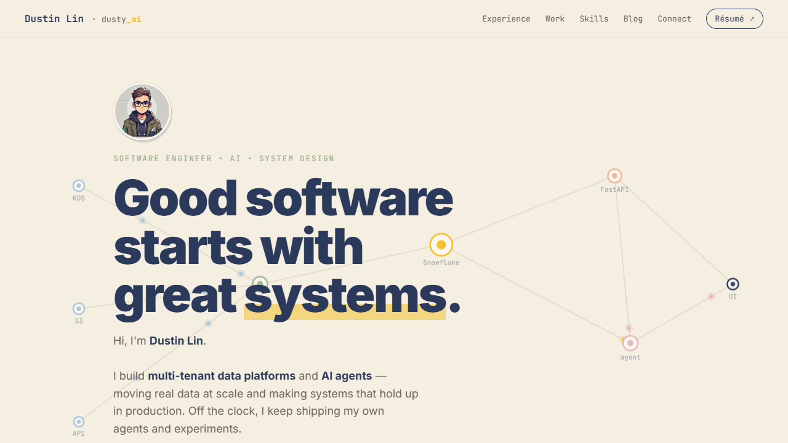

# dusty_ai — a personal website template

A clean, fast **personal portfolio + blog** you can make your own in an afternoon.
Plain HTML/CSS/JS — no build step, no framework — and free to host on GitHub Pages.

### ⚡ [**Use this template to build your own site →**](https://github.com/dustymemo/dusty_ai/generate)

**Live demo:** https://dustymemo.github.io/dusty_ai/ · **New to this?** → [START-HERE.md](START-HERE.md)

---

## ✨ What you get

- **One-page portfolio** — hero, experience timeline, selected work, projects, skills, and a Connect section
- **A little "Ask me" agent** — a chat widget that answers questions about you from a local knowledge base (no API key)
- **Blog + Playground** — post cards that open to detail pages, plus a live interactive demo section
- **One-file theming** — change every color and font from a single `theme.css`
- **Mobile menu, scroll animations, dark-navy-on-cream design** — responsive and accessible (respects reduced motion)

---

## 🚀 Make it yours

**Never written code?** → Start with **[START-HERE.md](START-HERE.md)** — a friendly,
browser-only walkthrough (no installs, no command line) that shows you how to copy
the template, host it free, and use an AI assistant to fill in your details.

**Comfortable editing files?** → See **[TEMPLATE.md](TEMPLATE.md)** for the quick
reference: rebrand in `theme.css`, edit content in `index.html`, add posts, deploy.

**Want an AI to do the editing?** → **[PROMPT.md](PROMPT.md)** has ready-made,
fill-in-the-blank prompts — paste your files into ChatGPT/Claude and it hands back
a finished, personalized site.

### The short version

1. Click **“Use this template”** above (or **Fork**) to get your own copy.
2. Edit **`theme.css`** for your colors/fonts, and **`index.html`** for your content.
3. Replace `assets/profile.png` and the résumé PDF.
4. Enable **Settings → Pages → Deploy from branch → `main` / root**.
5. Your site is live at `https://<your-username>.github.io/<repo>/`.

> 💡 **Repo owner:** turn on **Settings → Template repository** so visitors get a
> green **“Use this template”** button (a clean copy, no commit history).

---

## 📂 File map

| File | What it is |
|------|-----------|
| `index.html` | The home page (hero, experience, work, projects, skills, ask-agent, connect) |
| `theme.css` | **Brand tokens — colors & fonts for the whole site** |
| `blog.html` | Blog index (post cards) + Playground |
| `blog-*.html` | Individual blog posts |
| `post-template.html` | Blank post to copy for new entries |
| `nav.js` / `reveal.js` | Mobile menu + scroll-reveal animations |
| `assets/` | Profile photo, résumé, project images |
| `START-HERE.md` | Beginner (non-technical) guide |
| `PROMPT.md` | Copy-paste AI prompts to auto-fill your content |
| `TEMPLATE.md` | Technical customization reference |

---

## License

MIT — free to use, modify, and share.
